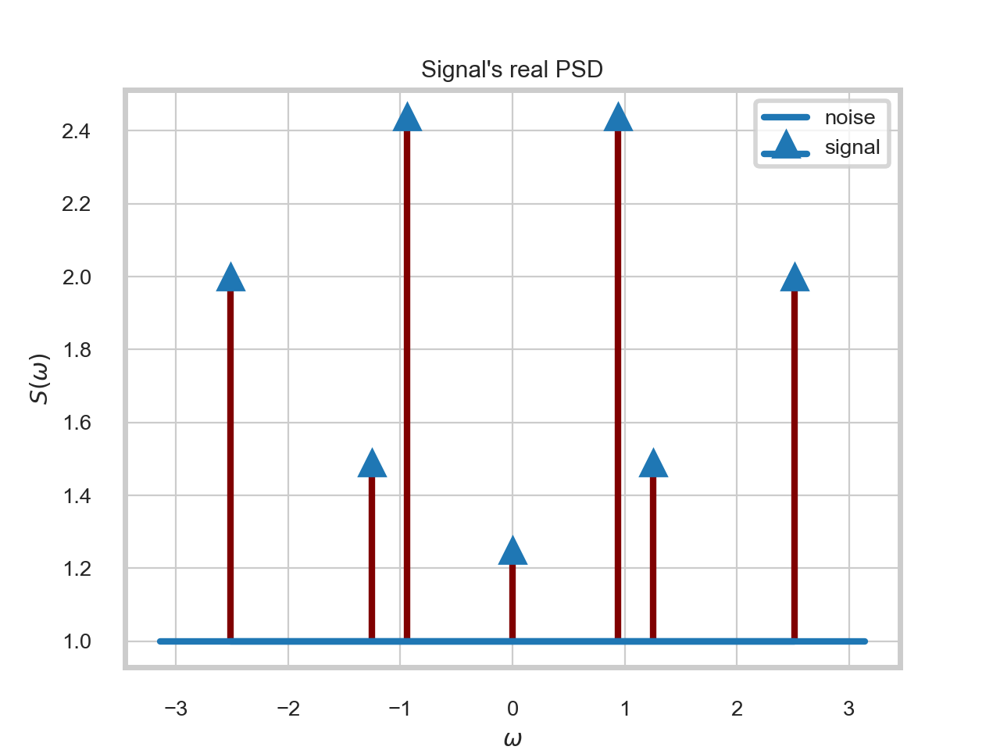
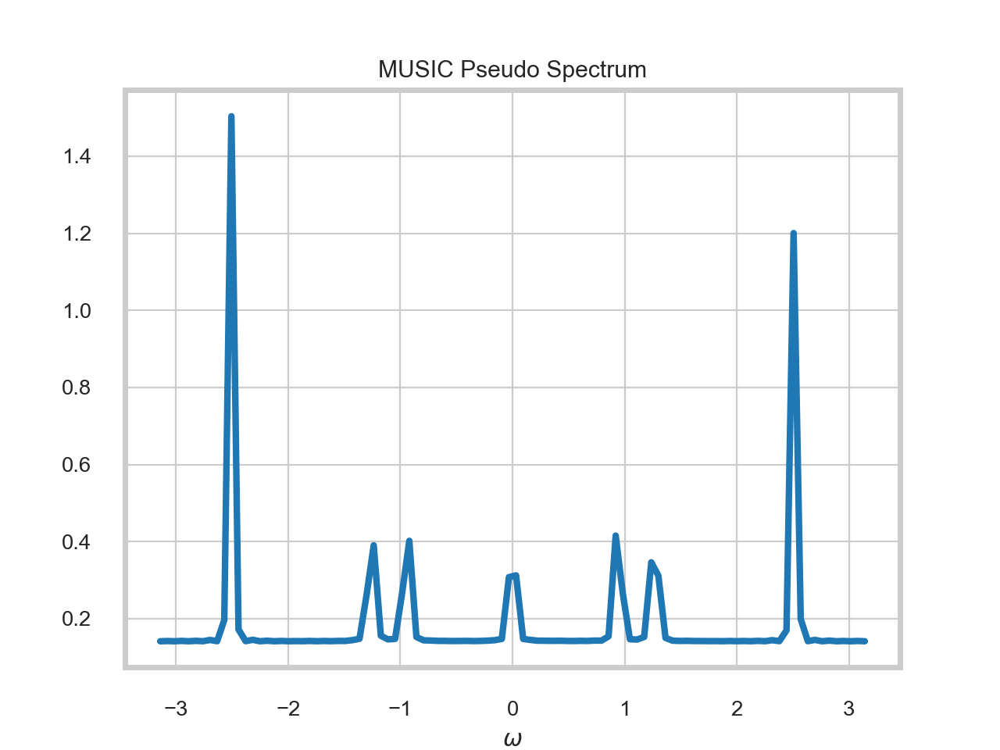
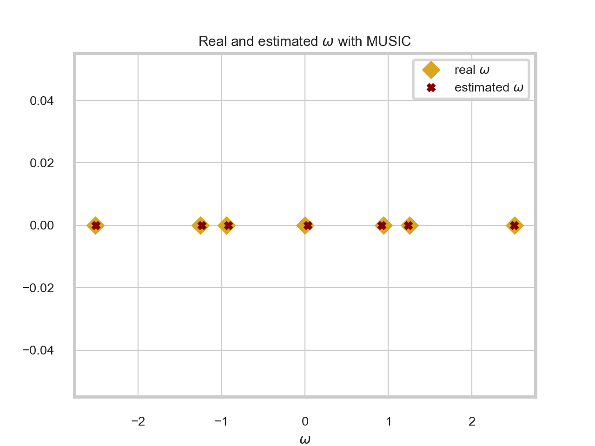
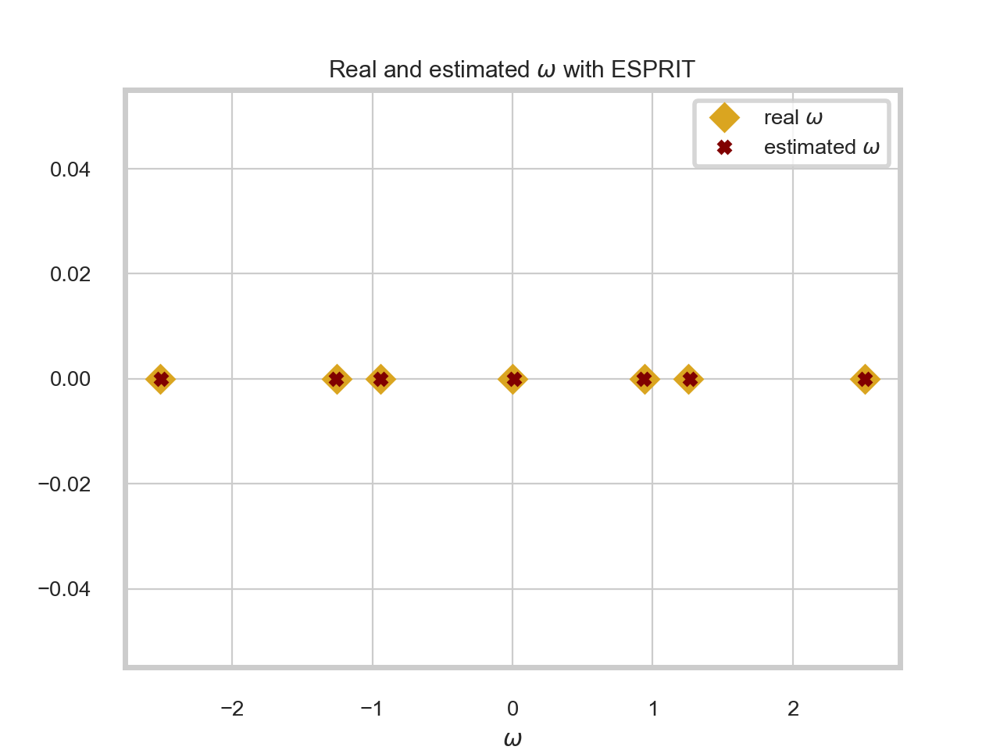

# Signal analysis for line spectra signals

Various algorithms for spectral estimation of line spectra, such as
* MUltiple SIgnal Classification (**MUSIC**) method 
* Min Norm method
* Estimation of Signal Parameters via Rational Invariance Techniques (**ESPRIT**) method

Based on the book "Spectral Analysis of Signals", P. Stoica &amp; R. Moses

## Methods results

To illustrate the results, let's look at the testing signal's real and pseudo spectrum of MUSIC method.

|  | |
|:---:|:---:|
| Real spectrum | Pseudo Spectrum (MUSIC) |

Below you can see real and estimated values of sinusoidal components. Note that the results of Min Norm method is very similar.

|  | |
|:---:|:---:|
| MUSIC estimation | ESPRIT estimation |

## Creating and running tests

To create your custom test, you can ```generate_signal``` and then ```apply_method``` from ```utils.py```.

To run any test simply go to the directory 'source' and type the following command in your terminal.

```
  python test.py
```
